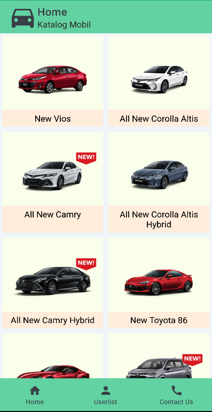
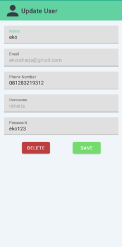

# UTS-PM-KatalogMobil

- Dibuat untuk kepentingan **Ujian Tengah Semester Pemrograman Mobile**.
- Dibuat bersama kelompok (Ferry, Felix, Kelvin, Reynaldo)
- Menampilkan daftar mobil dan informasi dari setiap mobil.
- Mengelolah pengguna yang terdaftar.
- Autentikasi pengguna.

Website ini dibuat menggunakan teknologi :
**_Android, Java, PHP, MySQL_**

# Tampilan Aplikasi

| Splash Screen                    | Login                            | Register                         |
| -------------------------------- | -------------------------------- | -------------------------------- |
|  |  |  |

| Katalog Mobil                    | Deskripsi Mobil                  |
| -------------------------------- | -------------------------------- |
|  |  |

| Daftar Pengguna                  | Update Pengguna                  |
| -------------------------------- | -------------------------------- |
|  |  |
